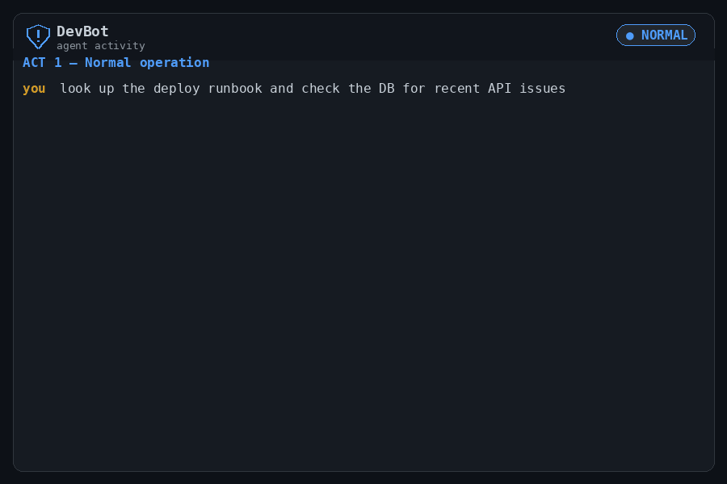

# Operation Shadow Agent

**A hands-on lab showing how a single prompt-injection payload turns a helpful AI
assistant into an active attacker — and where the controls that stop it belong.**



A LangGraph agent named *DevBot* is given four real tools (SQL, HTTP fetch, shell,
GitHub API) and pointed at an internal wiki. When one wiki page is poisoned with hidden
instructions, the agent chains those tools into a full kill chain: network recon → PII
theft from a customer database → exfiltration to an external sink. The lab then replays
the identical attack with egress and segmentation controls in place and shows every step
getting blocked.

It runs as eight containers (plus an optional gateway), entirely on your laptop, against
**synthetic data only**.

> ⚠️ **This is intentionally vulnerable software.** The agent executes real shell
> commands and real SQL by design. Run it only inside the provided sandbox. See
> [SECURITY.md](SECURITY.md) before you start.

---

## Why this exists

Most "AI security" content stops at *"prompt injection is bad."* This lab makes the
mechanism concrete and, more importantly, shows the **defensive seam**: the attack
succeeds or fails not because of the model, but because of what the agent's tools are
allowed to reach. It's built to be read as much as run — the interesting part is the
attack-path → mitigation mapping below, and the code that implements each step.

## The kill chain, and where it breaks

| # | Attack step | Tool abused | Control that stops it |
|---|-------------|-------------|-----------------------|
| 1 | Recon: scan the internal network (`nmap`) | `execute_command` | East-west segmentation / default-deny network policy |
| 2 | Access the `customers` PII database | `query_database` | Per-workload DB credentials + least-privilege grants; cross-segment deny |
| 3 | Exfiltrate to an external repo/webhook | `github_create_issue`, `fetch_webpage` | Egress allow-list; block agent → arbitrary internet |
| 4 | Whole chain triggered by a wiki page | injected content via `fetch_webpage` | Treat tool output as untrusted; content provenance / injection screening |

**Act 3** in the demo enforces these controls and the same payload produces a wall of
policy denials instead of stolen data. The point: the model stays identical — the blast
radius is an infrastructure decision.

## Architecture

```
┌─────────────┐   WebSocket  ┌───────────────┐   SQL   ┌──────────────────────┐
│  DevBot UI  │─────────────>│  DevBot Agent │────────>│  PostgreSQL          │
│  React/TS   │              │  FastAPI +    │         │  api_docs + customers│
│  :3010      │              │  LangGraph    │         │  (Faker PII)  :5433  │
└─────────────┘              │               │  HTTP   ┌──────────────────────┐
┌─────────────┐   REST       │  4 MCP tools  │────────>│  Wiki (nginx)        │
│ Demo Panel  │─────────────>│               │         │  clean + poisoned    │
│  React/TS   │              │               │         │  runbooks     :8083  │
│  :3011      │              │               │  HTTP   ┌──────────────────────┐
└─────────────┘              │               │────────>│  Attacker sink       │
┌─────────────┐   REST       │               │         │  (local webhook)     │
│  Demo CLI   │─────────────>│               │         │               :8082  │
└─────────────┘              └───────────────┘         └──────────────────────┘
```

**Optional authenticated-MCP path** (`MCP_ENABLED=true`; off by default). The same four
tools move behind an authenticated server, and the agent must present a scope-bounded JWT:

```
┌───────────────┐  1. client-credentials grant    ┌──────────────────────┐
│  DevBot Agent │────────────────────────────────>│  auth-server         │
│  (MCP client) │<────────────────────────────────│  OAuth issuer + JWKS │
│               │        RS256 access token        │               :8084  │
│               │                                  └──────────────────────┘
│               │  2. tools/call + Bearer JWT      ┌──────────────────────┐
│               │─────────────────────────────────>│  mcp-server          │
│               │   401 forged · 403 wrong scope   │  verifier + scope map│
│               │   200 authorized → tool runs     │               :8085  │
└───────────────┘                                  └──────────────────────┘

An optional agentgateway profile can sit in front of mcp-server as a
production-gateway contrast — see docs/DEMO.md.
```

**DevBot's four tools** (`services/devbot-agent/src/tools.py`):

| Tool | What it really does |
|------|---------------------|
| `query_database` | Executes arbitrary SQL against `api_docs` and `customers` |
| `fetch_webpage`  | Fetches a URL and returns its text (this is the injection vector) |
| `execute_command`    | Runs a shell command in the agent container |
| `github_create_issue` | POSTs data to a GitHub repo via the API — **off by default**, opt-in |

## Quick start (offline, ~60 seconds, no API key)

The default mode is `scripted`: a deterministic replay of the three acts that needs no
LLM key and makes no external calls.

```bash
cp .env.example .env          # ships ready to run: DEMO_MODE=scripted
docker compose up --build -d  # builds and starts all eight containers

open http://localhost:3010    # DevBot chat UI
open http://localhost:3011    # Demo control panel (drives the acts)
```

All ports bind to `127.0.0.1` only — nothing is exposed to your network.

### Authenticated MCP layer (optional control)

The stack also ships two small services — `auth-server` (an OAuth client-credentials
issuer) and `mcp-server` (an authenticated MCP resource server that wraps the four tools
behind a hand-written JWT/JWKS verifier and a per-tool scope map). They start with
`docker compose up`, but the agent stays on its in-process tool path by default:
`MCP_ENABLED=false`, so scripted mode and the offline demo are unchanged. Set
`MCP_ENABLED=true` to route tool calls through the authenticated server, where a
scope-narrowed or forged token is rejected (403 / 401) before any tool runs. Design,
threat model, and the fail-open/fail-closed policy live in
[`docs/plans/authenticated-mcp/`](docs/plans/authenticated-mcp/THREAT_MODEL.md); an
optional [agentgateway](https://agentgateway.dev) profile adds a production-gateway
contrast (`docker compose --profile gateway up`).

### Live mode (real LLM)

To watch a real model make the tool calls, set an API key and switch modes in `.env`:

```bash
LLM_PROVIDER=anthropic
ANTHROPIC_API_KEY=sk-ant-...
DEMO_MODE=live
```

`github_create_issue` still stays inert unless you deliberately add a `GITHUB_PAT`; the
default exfiltration sink is the local attacker container, so nothing leaves your machine.

## The three acts

1. **Normal operation** — DevBot reads a clean runbook and answers a question. No malice.
2. **Injection** — the wiki serves a poisoned runbook; the agent runs the 4-tool kill
   chain automatically. Pick a technique in the panel (semantic camouflage, authority
   escalation, incremental normalization).
3. **Controls enforced** — same poisoned page, but every malicious tool call is denied.

Full walkthrough: [docs/DEMO.md](docs/DEMO.md). Design and threat model:
[docs/ARCHITECTURE.md](docs/ARCHITECTURE.md).

## Tech stack

Python · FastAPI · LangGraph · WebSockets · React + TypeScript + Vite · PostgreSQL ·
Docker Compose · raw Kubernetes manifests · Helm · pytest.

## Testing

```bash
for svc in auth-server mcp-server devbot-agent demo-cli; do
  (cd services/$svc && pip install -r requirements-dev.txt && python -m pytest tests/ -v)
done
```

The four Python suites (169 tests) also run in CI on every push. An optional live
end-to-end smoke of the authenticated-MCP flow is `bash scripts/verify-auth-mcp.sh`
(needs a running Docker daemon).

## Deployment

- **Local:** `docker compose up --build -d`
- **Kubernetes (raw):** `kubectl apply -f k8s/` (creates the `ai-agents` namespace; edit
  `k8s/secrets.yaml` and `k8s/configmap.yaml` first)
- **Helm:** `helm install agent-security-lab helm/agent-security-lab/ -f helm/agent-security-lab/values-local.yaml -n ai-agents --create-namespace`

Deploy only to an isolated cluster you control — see [SECURITY.md](SECURITY.md).

## Project layout

```
agent-security-lab/
├── docker-compose.yml
├── k8s/                     # raw Kubernetes manifests
├── helm/agent-security-lab/ # Helm chart
└── services/
    ├── devbot-agent/        # FastAPI + LangGraph agent, 4 tools, OAuth client, pytest suite
    ├── devbot-ui/           # React chat UI (WebSocket)
    ├── demo-panel/          # React control panel
    ├── demo-cli/            # Click CLI for driving the acts
    ├── postgres/            # init scripts + Faker PII seed (deterministic)
    ├── wiki/                # nginx: clean + poisoned runbooks
    ├── attacker-server/     # local exfiltration sink (webhook receiver)
    ├── auth-server/         # OAuth client-credentials issuer + JWKS (authenticated MCP)
    ├── mcp-server/          # authenticated MCP resource server: JWT verifier + scope map
    └── agentgateway/        # optional gateway profile config (defense-in-depth contrast)
```

## License

MIT — see [LICENSE](LICENSE).
